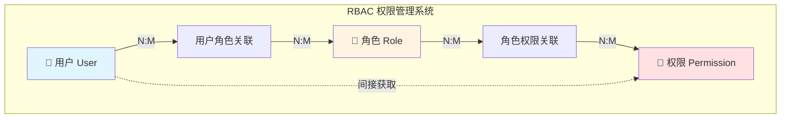
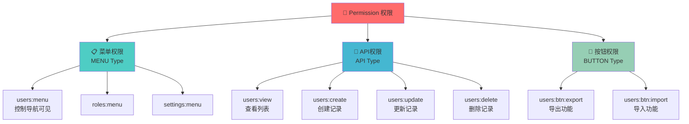
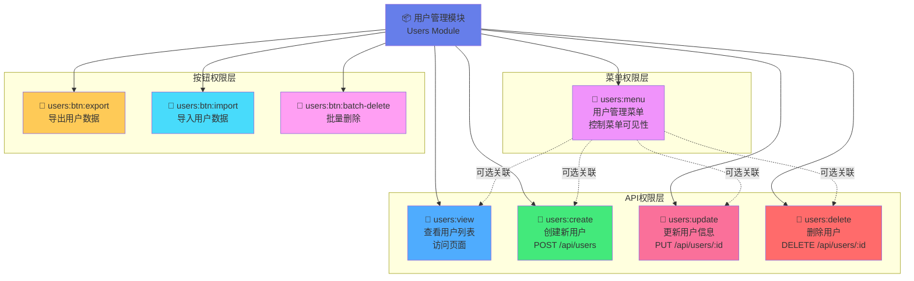
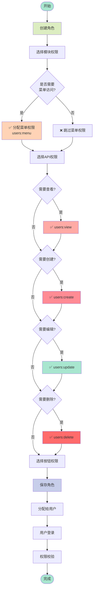
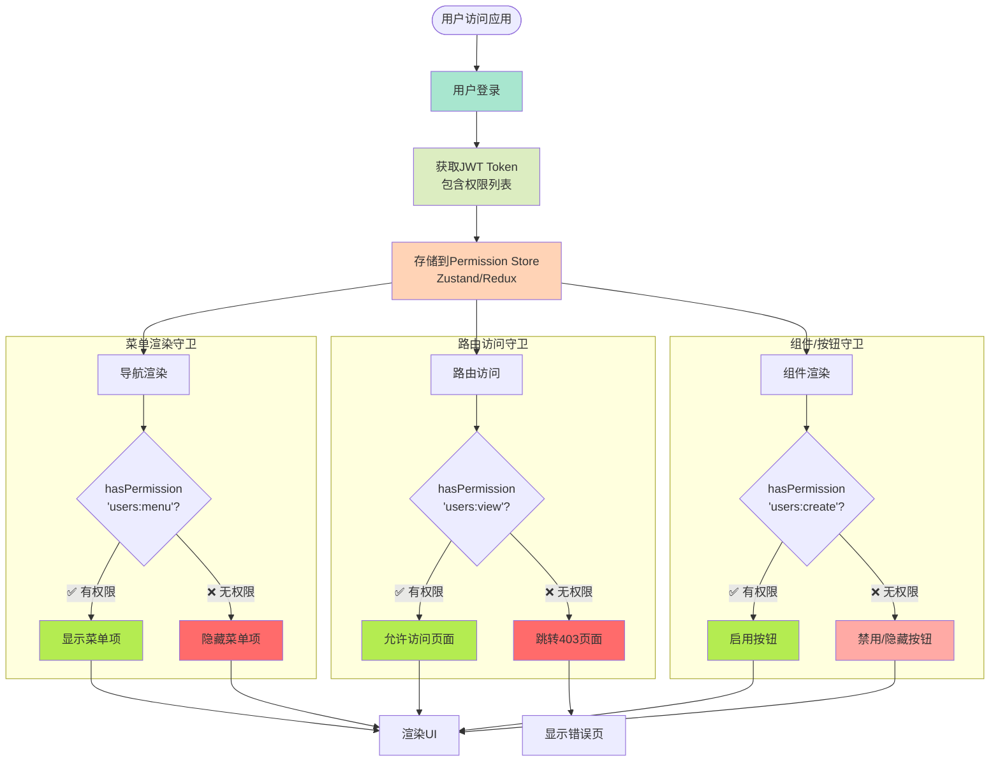
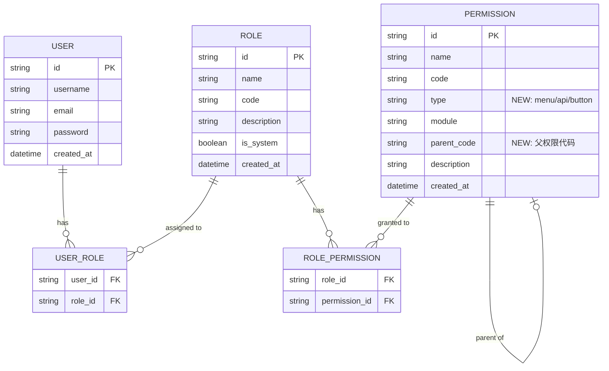
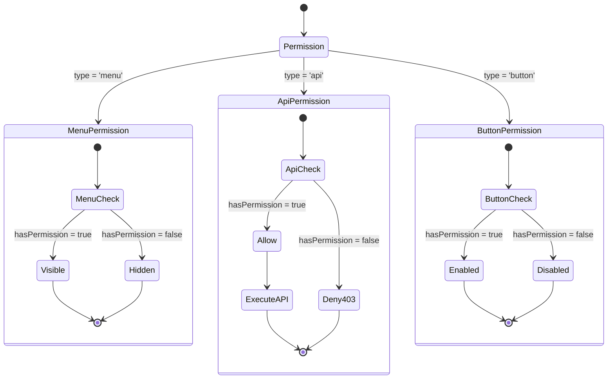
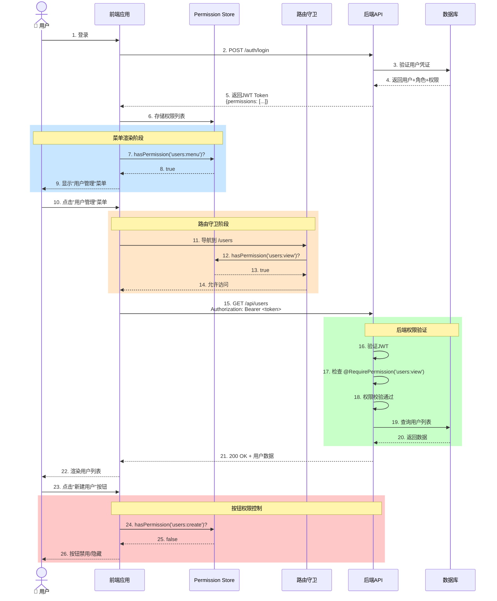
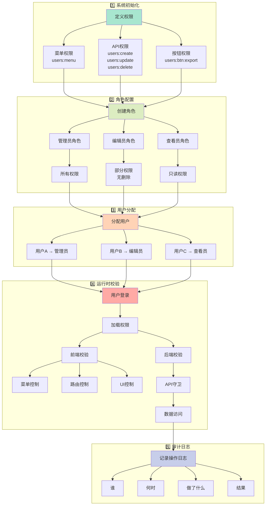
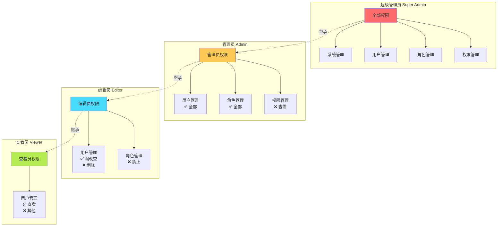

# 权限管理架构 - Mermaid 流程图

## 1. RBAC 整体架构



## 2. 权限分类体系



## 3. 用户管理模块权限树



## 4. 权限分配流程



## 5. 前端权限校验流程



## 6. 后端API权限校验流程

```mermaid
flowchart TB
    Request([HTTP Request]) --> Headers{携带Token?}
    Headers -->|❌ 否| Return401[返回 401<br/>Unauthorized]
    Headers -->|✅ 是| VerifyToken[验证JWT Token]

    VerifyToken --> TokenValid{Token有效?}
    TokenValid -->|❌ 否| Return401
    TokenValid -->|✅ 是| ParseToken[解析Token<br/>获取用户权限]

    ParseToken --> CheckEndpoint[检查API端点<br/>所需权限]

    subgraph "权限验证"
        CheckEndpoint --> GetRequired[获取@RequirePermission<br/>装饰器配置]
        GetRequired --> Example1[POST /users<br/>需要: users:create]
        GetRequired --> Example2[PUT /users/:id<br/>需要: users:update]
        GetRequired --> Example3[DELETE /users/:id<br/>需要: users:delete]
    end

    Example1 --> HasPerm{用户有该权限?}
    Example2 --> HasPerm
    Example3 --> HasPerm

    HasPerm -->|❌ 否| Return403[返回 403<br/>Forbidden]
    HasPerm -->|✅ 是| ExecuteAPI[执行API逻辑]

    ExecuteAPI --> DBOperation[数据库操作]
    DBOperation --> Success{操作成功?}
    Success -->|✅ 是| Return200[返回 200<br/>成功响应]
    Success -->|❌ 否| Return500[返回 500<br/>服务器错误]

    style Request fill:#a8e6cf
    style VerifyToken fill:#dcedc1
    style ParseToken fill:#ffd3b6
    style ExecuteAPI fill:#b4ec51
    style Return200 fill:#b4ec51
    style Return401 fill:#ff6b6b
    style Return403 fill:#ff6b6b
    style Return500 fill:#ff9ff3
```

## 7. 权限数据模型 (ER图)



## 8. 权限类型状态图



## 9. 权限校验时序图



## 10. 完整权限管理流程



## 11. 权限继承关系图



## 使用说明

### 如何在Markdown中使用:

1. **直接嵌入**: 复制上述代码块到任意支持Mermaid的Markdown编辑器
2. **GitHub/GitLab**: 直接渲染
3. **VS Code**: 安装 `Markdown Preview Mermaid Support` 插件
4. **在线预览**: https://mermaid.live/

### 图表说明:

- **图表 1-3**: 架构设计和数据模型
- **图表 4-6**: 业务流程和校验逻辑
- **图表 7-9**: 数据关系和状态转换
- **图表 10-11**: 完整流程和权限继承

### 颜色约定:

- 🟢 绿色: 成功/允许/启用
- 🔴 红色: 失败/拒绝/禁用
- 🔵 蓝色: 处理中/校验中
- 🟡 黄色: 警告/部分权限
